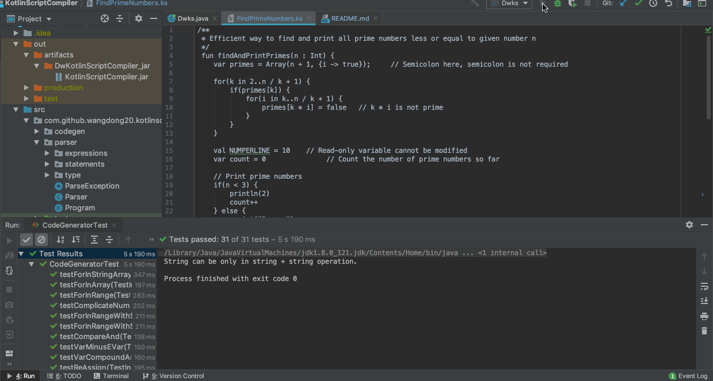

# DWKotlinScriptCompiler
这是我在编译原理课程里尝试写的语法类似Kotlin的编程语言编译器

### README.md
* en [English](README_en.md)
* zh_CN [简体中文](README.md)

### 语言名称
DWKotlinScript

### 所使用的编程语言和为什么用这个语言
Java。我对java非常熟悉，而且java和kotlin在JVM字节码上完全兼容，所以用Java来写类Kotlin语言的编译器是很合适的.

### 目标语言
JVM 字节码.

### 语言介绍
Kotlin是一个跨平台，静态类型，支持类型推论的编程语言。Kotlin设计成完全兼容Java，Java在JVM里的Java类库，但是Kotlin所支持的类型推论使其语法比java来的更简洁。2019年，Google宣布Kotlin作为Android开发第一语言，从这里我也看到使用Kotlin的好处。DwKotlinScript就是借鉴了Kotlin语言里语法简洁的优点来实现自己类似Kotlin语言的编译器。

### DwKotlinScript相对于Kotlin语言的限制
Kotlin是一个强大的面对对象的编程语言，因为时间和精力的限制以及本人对编译器知识理解的限制，我要对我的类Kotlin编程语言做一些限制。DwKotlinScript语言将不支持面对对象，也就是说不支持类和对象。目前支持的数字类型只有Int类型，String类型会支持，因为String在编程语言里面很重要，数组也会支持，由于没有类，所以相对数组的泛型只支持Int，String，Boolean，Object。本来在语法层面支持高阶函数，Lambda表达式，但是由于不支持类与对象，不知道怎么在JVM字节码层面实现高阶函数，毕竟在我所在的Java1.8版还没有支持高阶函数，当然也会支持类型推论，函数定义不能在另一个块里面。

### 语法
* var 代表变量
* fn 代表函数名
* e 代表表达式
* binop 代表二元运算符
* unop 代表一元运算符
* s 代表语句
* op 代表运算符
* T 代表类型变量
* P 代表程序
```
Basic type::= Int | String | Boolean | Unit | Any

type :: = Int | Boolean| String | Array<basic type> | ‘(‘type*’)’ -> type | T

e :: = ‘(‘ e ’)’ | e1 binop e2 | unop e |  fn’(‘e’)’ | var | arrayOf(var*) | Array(e1(Int), {e2((Int) -> basic type)}) | var = e | var += e | var -= e | var *= e | var /= e |‘{‘ (var : type)* -> e(return basic type) ‘}’ | '$'var | '$''{'e'}'

binop :: = ‘-’ | ‘+’ | ‘/’ | ‘*’ | ‘%’ | ‘||’ | ‘&&’ | ‘<’ | ‘>’ | ‘<=’ | ‘>=’ | ‘==’ | ‘!=’ | ‘+=’ | ‘-=’ | '*=' | '/=' | '='

unop :: = ‘!’ | ‘++’ | ‘--’

s :: = ‘if’ ‘(’ e ‘)’ ‘{‘ s* ‘}’ ‘else’ ‘{‘ s* ‘}’ | ‘if’ ‘(’e’)’ ’{’ s* ‘}’ | ‘while’ ‘(’ e ‘)’ ‘{’ s* ‘}’ | ‘return’ e | break | continue | ‘for’ ‘(’ var ‘in’ Array<basic type> ‘)’ ‘{’ s* ‘}’ |‘for’ ‘(’ var ‘in’ var(Int)'..'var(Int) ‘)’ ‘{’ s* ‘}’ | ‘for’ ‘(’ var ‘in’ var(Int)'..'var(Int) step var(Int)‘)’ ‘{’ s* ‘}’ | ‘var’ var = e | ‘val’ var = e | print’(‘var’)’ | println’(‘var’)’ | fun funcName((var: Type)*) { s* }

P :: = s*
```

### 程序入口: 
程序所有语句。

### 支持特性
类型推论. var, val可以定义变量而不用赋予类型信息给变量，这个和Kotlin里的类型推论是一样的。

### 支持特性 #2
分号推论。 Kotlin支持所有语句不用;结尾。DwKotlinScript也会支持编译器能理解对非;结尾而是回车键结尾的语句断句。

### 支持特性 #3
字符串插值。当用Print语句打印字符串时，这个字符串将会识别在字符串里的表达式并把表达式的值打印出来。例如，print("$a + $b is ${a + b}")，这里打印的字符串将会识别a，b以及a + b的值并打印出来。所以如果你也想要字符串里插入表达式，只要在表达式前添加$就行了。

### 其他特性
该编译器支持注释，你可以在代码里面写任何注释不会影响运行。注释的格式和Java注释格式一样。

表达式的运算是基于JVM字节码进行运算的，有的编译器可能借助自己写编译器的编译器来计算表达式然后把计算后的值直接放到JVM字节码里，我写的编译器不会这样做，它会更接近底层JVM字节码不会借助我写这个编译器的编译器来计算表达式。

简而言之就是，假如var a = 1 + 2 * 3 / 6，我的编译器不会把表达式1 + 2 * 3 / 6的值计算出来，再在JVM字节码里把计算的值赋给a，而是一步一步的讲1，2，3，6压入JVM的栈中进行运算。

## 怎样运行?
首先clone该仓库代码，然后build项目，因为该编译器会读取并编译以.ks为后缀的代码文件，所以你只需要把写好的以.ks为后缀的代码文件放到项目根目录下，然后运行Dwks.java里的main函数，在命令行里输入dwks *.ks来编译你自己写的代码文件，然后输入java *来运行编译好的字节码。
```
dwks *.ks
java *
```
这里的*代表你写的代码文件名。

作为演示，我写了3个以.ks为后缀的代码文件在项目根目录里，你们可以输入如下命令测试这些代码文件。
```
dwks TestBubbleSort.ks
java TestBubbleSort

dwks FindPrimeNumbers.ks
java FindPrimeNumbers

dwks PrintStar.ks
java PrintStar
```
## 运行示例
